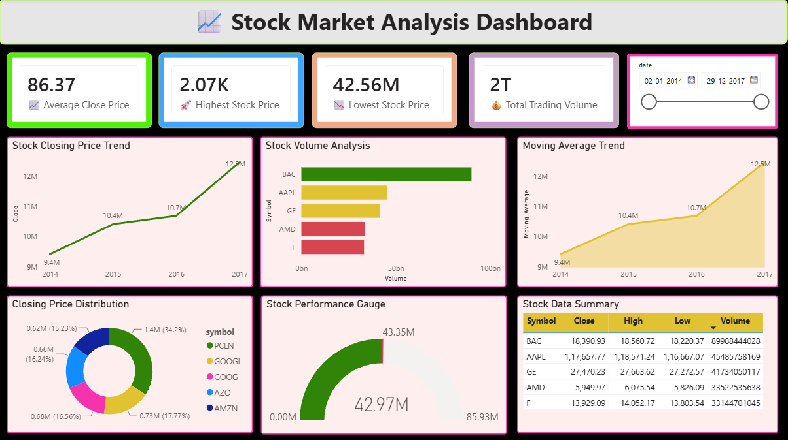

# 📈 Stock Market Analysis Dashboard

This folder contains a Power BI dashboard project developed during the **Codveda Technologies Data Analytics Internship**.

The dashboard provides insights into stock market performance using interactive visualizations and KPI analysis.

---

# 📂 Files Included

- `Stock_Market_Analysis_Dashboard.pbix` → Power BI Dashboard File
- `Dashboard.png` → Dashboard Preview
- `Summary.png` → Dashboard Insights Summary

---

# 📊 Dashboard Features

## ✅ KPI Cards
- Average Closing Price
- Highest Stock Price
- Lowest Stock Price
- Total Trading Volume

## ✅ Visualizations
- Stock Closing Price Trend
- Stock Volume Analysis
- Moving Average Trend
- Donut Chart Distribution
- Performance Gauge
- Data Summary Table

## ✅ Interactive Features
- Date Range Slicer
- Dynamic Filtering
- Interactive Dashboard Navigation

---

# 🛠️ Tools Used

- Power BI
- Data Visualization
- Time Series Analysis

---

# 📸 Dashboard Preview

---
# Summary

# 📌 Key Insights

- Stock closing prices showed an increasing trend over time.
- Trading volume varied significantly among different companies.
- Moving average analysis helped identify market trends.
- Some stocks contributed a larger share to overall market activity.
- Interactive filtering improved comparative stock analysis.

---

# ⭐ Conclusion

This dashboard demonstrates practical implementation of:
- Business Intelligence
- Data Visualization
- KPI Reporting
- Interactive Dashboard Design
- Stock Market Trend Analysis

The project highlights how Power BI can transform raw stock market data into meaningful visual insights.
